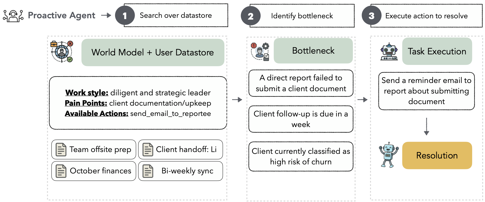

# Beyond Reactivity: Measuring Proactive Problem Solving in LLM Agents (PROBE benchmark)

[](https://arxiv.org/pdf/2510.19771)
[](https://huggingface.co/datasets/gilfastino/PROBE)
[](LICENSE)

*Gil Pasternak, Dheeraj Rajagopal, Julia White, Dhruv Atreja, Matthew Thomas, George Hurn-Maloney, Ash Lewis*

---

## Overview
<p align="center">
  
</p>

PROBE (**P**roactive **R**esolution **o**f **B**ottl**e**necks) evaluates AI agents on **proactivity**: anticipating user needs from continuous observation and solving problems autonomously across realistic, multi-document workplace scenarios. Rather than awaiting explicit instruction, proactive agents must search for unspecified issues, identify critical bottlenecks, and execute appropriate resolutions.

The model (or agent) uses the world model to: **(i)** search over the user datastore, **(ii)** identify the bottleneck, and **(iii)** select the action to execute. The model is evaluated across all three tasks in this pipeline.


### 🎯 Three Core Capabilities

1. **🔍 Search** — Finding relevant information across a personalized datastore
2. **🎯 Identification** — Detecting specific bottlenecks in retrieved content  
3. **✅ Resolution** — Executing appropriate actions to resolve issues

### 📊 Benchmark Stats

- **1,000 test samples** across easy/medium/hard difficulty
- **Authentic personas** from LinkedIn professional profiles  
- **Multi-document context** with emails, calendars, and documents
- **Capability ceiling:** Even state-of-the-art models achieve only **40% end-to-end success** (GPT-5, Claude Opus 4.1), revealing substantial challenges in developing truly proactive AI systems

---

## 📦 Installation

```bash
git clone https://github.com/fastino/PROBE.git
cd PROBE
pip install -e .

# Set up API key
echo "OPENAI_API_KEY=your_api_key_here" > .env
```

**Requirements:** Python 3.12+, OpenAI API key

**Optional extras:**
```bash
pip install -e ".[baselines]"  # For agentic baselines (ReAct, Reflexion, ReWOO)
pip install -e ".[ui]"          # For annotation interface
pip install -e ".[all]"         # Everything
```

---

## 🚀 Quick Start

### 1️⃣ Get Benchmark Data

**Option A: Use Pre-generated Dataset (Recommended)**

Download the complete 1,000-sample benchmark from Hugging Face:

```bash
pip install huggingface-hub
huggingface-cli download gilfastino/PROBE --repo-type dataset --local-dir data/probe_benchmark

# Extract the files
cd data/probe_benchmark
unzip sept_23_1000_inputs_20250923_131956.zip
unzip sept_23_1000_outputs_20250923_131956.zip
```

**Option B: Generate Custom Data**

```bash
python run.py --mode batch --count 5 --difficulty medium
```

Output: `generated_data/TIMESTAMP_batch/inputs/` and `outputs/`

### 2️⃣ Run Inference

**Option A: LLM Baseline (single-pass, native batch APIs)**
```bash
python baselines/llm/run_native_batch_evaluation.py \
  --models gpt-5 claude-opus-4-1-20250805 \
  --data_dir generated_data/TIMESTAMP_batch/inputs
```

**Option B: Agentic Baseline (multi-step reasoning)**
```bash
# Run with a single agent and model
python baselines/agentic/inference.py \
  --data_dir generated_data/TIMESTAMP_batch/inputs \
  --output_dir results/my_experiment \
  --model gpt-4.1 \
  --agent react_agent

# To test multiple models simultaneously
python baselines/agentic/inference.py \
  --data_dir generated_data/TIMESTAMP_batch/inputs \
  --output_dir results/my_experiment \
  --models gpt-4.1 gpt-5 \
  --agent reflexion_agent \
  --multi_model
```

### 3️⃣ Evaluate

```bash
# Basic evaluation with exact matching
python evaluation/batch_evaluate_baselines.py \
  --predictions-dir results/my_experiment/inputs \
  --labels-dir generated_data/TIMESTAMP_batch/outputs

# With LLM judge for semantic similarity (recommended)
python evaluation/batch_evaluate_baselines.py \
  --predictions-dir results/my_experiment/inputs \
  --labels-dir generated_data/TIMESTAMP_batch/outputs \
  --use-llm-judge \
  --output-file results/evaluation.json
```

**Arguments:**
- `--predictions-dir`: Directory containing model predictions (with subdirs per model, e.g., `react_agent_gpt-4.1/`)
- `--labels-dir`: Directory containing ground truth labels (`*_output.json` files)
- `--inputs-dir`: (Optional) Directory containing input files. Defaults to `labels-dir/../inputs`
- `--use-llm-judge`: Enable LLM-based semantic matching for bottleneck identification
- `--output-file`: Where to save results (default: auto-generated timestamp)

**Supported Prediction Formats:**
- Individual JSON files (one per example): `model_name/example_id_results.json`
- Batch API JSONL files: `model_name/combined_batches.jsonl` (automatically extracts predictions from Anthropic/OpenAI batch formats)

---

## 📂 Repository Structure

```
PROBE/
├── run.py                    # Data generation entry point
├── configs/                  # Configuration schemas
├── data_generation/          # Generation pipeline
│   ├── generators/           # World model, bottleneck, checklist, evidence
│   ├── prompts/              # Jinja2 templates
│   └── data/                 # LinkedIn personas
├── baselines/
│   ├── agentic/              # ReAct, Reflexion, ReWOO
│   └── llm/                  # Direct LLM (batch APIs)
├── evaluation/               # Scoring and evaluation
└── generated_data/           # Benchmark outputs
```

---

## ⚙️ Configuration

### Data Generation

**CLI:**
```bash
python run.py \
  --mode batch \
  --count 100 \
  --difficulty hard \
  --workers 8 \
```

**YAML config:**
```yaml
mode: batch
count: 100
difficulty: medium
generate_distractors: true
distractor_count: 10
max_workers: 8
```

Run: `python run.py --config config.yaml`

### Environment Variables

```bash
# Required
OPENAI_API_KEY=sk-...          # For OpenAI models (data generation & evaluation)

# Optional (for specific models)
ANTHROPIC_API_KEY=sk-ant-...   # For Claude models
GOOGLE_API_KEY=...             # For Gemini models
HUGGINGFACE_TOKEN=hf_...       # For LinkedIn persona dataset access
```

---

## 📊 Evaluation

### Metrics

PROBE evaluates three core capabilities:

| Component | What it tests | Metric |
|-----------|---------------|--------|
| 🔍 **Search** | Retrieved relevant documents | F1 score (precision × recall) |
| 🎯 **Identification** | Detected correct bottleneck | Exact match or LLM-judge similarity |
| ✅ **Resolution** | Selected right action + parameters | Action match + parameter accuracy |
| 📈 **Overall** | End-to-end performance | Average of all three components |

### Running Evaluation

```bash
# Evaluate all models in predictions directory
python evaluation/batch_evaluate_baselines.py \
  --predictions-dir results/my_experiment/inputs \
  --labels-dir generated_data/TIMESTAMP_batch/outputs \
  --use-llm-judge \
  --output-file results/evaluation.json

# Evaluate specific models only
python evaluation/batch_evaluate_baselines.py \
  --predictions-dir results/my_experiment/inputs \
  --labels-dir generated_data/TIMESTAMP_batch/outputs \
  --models react_agent_gpt-4.1 baseline_agent_gpt-5 \
  --use-llm-judge
```

The script outputs:
- JSON file with detailed per-example scores
- CSV summary with aggregate statistics
- Leaderboard printed to console

## 🤖 Adding Custom Baselines

### Agentic Baseline

```python
from baselines.agentic.base_agent import BaseAgent

class MyAgent(BaseAgent):
    def run(self, world_model, corpus):
        # 1. Search
        docs = self.retrieve_documents(corpus)
        
        # 2. Identify
        bottleneck = self.identify_bottleneck(docs, world_model)
        
        # 3. Resolve
        action = self.select_action(bottleneck, world_model)
        
        return {
            "retrieved_documents": [d["id"] for d in docs],
            "bottleneck": bottleneck,
            "action": {"function_name": action["name"], "parameters": action["params"]}
        }
```

Register in `baselines/agentic/inference.py` and run with `--agent myagent`.

---

## 📚 Citation

If you use PROBE in your research, please cite our paper:

```bibtex
@article{pasternak2025probe,
  title={Beyond Reactivity: Measuring Proactive Problem Solving in LLM Agents},
  author={Pasternak, Gil and Rajagopal, Dheeraj and White, Julia and Atreja, Dhruv and Thomas, Matthew and Hurn-Maloney, George and Lewis, Ash},
  journal={arXiv preprint arXiv:XXXX.XXXXX},
  year={2025}
}
```

---

## 🤝 Contributing

We welcome contributions!

**Areas:**
- 🤖 New baselines
- 🔧 Additional bottleneck types
- 🎭 Better distractor generation
- 📊 New evaluation metrics

**Process:**
1. Fork the repository
2. Create feature branch: `git checkout -b feature/amazing-feature`
3. Make changes with tests
4. Run linters: `black`, `mypy`
5. Submit PR

---

## 📖 Additional Documentation

- **Detailed Examples:** [data_generation/examples/](data_generation/examples/)
- **Prompt Templates:** [data_generation/prompts/](data_generation/prompts/)
- **Annotation UI:** [data_generation/ui/](data_generation/ui/)
- **Ablation Studies:** [scripts/](scripts/)

---

## 🔧 Troubleshooting

**Rate limits:** Adjust `--workers` (generation) or `--max_workers` (inference)

**Memory issues:** Use `--count 10` and `--no-distractors` for testing

**Import errors:** `pip install -e .` or `pip install -e ".[baselines]"`

**Evaluation issues:** Ensure directory has `inputs/` and `outputs/` subdirectories

---

## 📄 License

This project is licensed under the **MIT License** - see the [LICENSE](LICENSE) file for details.

Copyright (c) Fastino Inc 2025

### Citation & Usage

If you use PROBE in your research, please cite our paper (see [Citation](#-citation) section above). 

**Contact:** GitHub Issues for bug reports • GitHub Discussions for questions

---

**Built for advancing proactive AI research** 🚀
